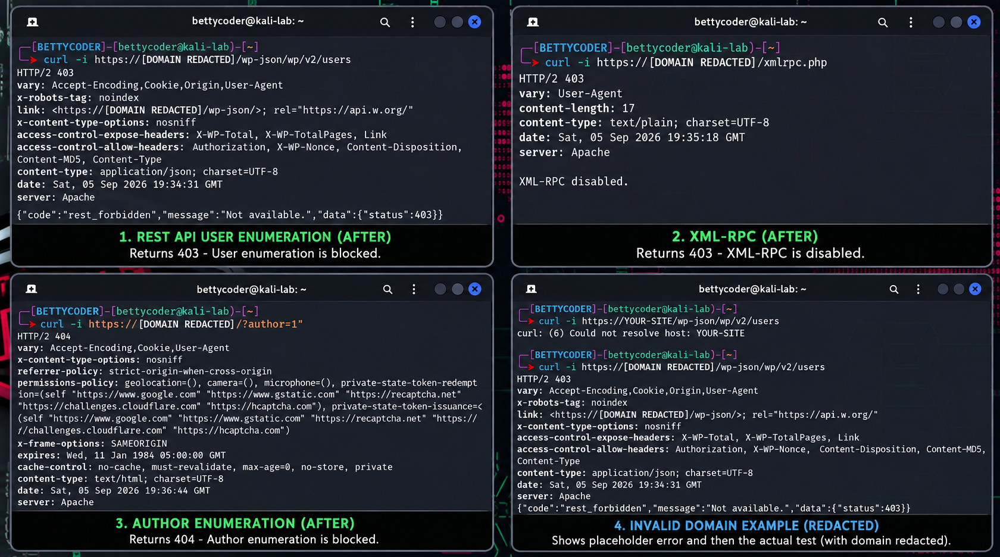

<div align="center">

# BettyCoder WordPress Privacy Hardening

**A lightweight WordPress security and privacy hardening plugin built from a real before → remediate → retest lab.**


</div>

---

## 🧪 Verified After-Hardening Results

<div align="center">



</div>

The screenshot above is a sanitized retest of the same endpoints after activating the plugin.

| Test | Expected hardened result | Verified |
|---|---:|---:|
| REST API user enumeration | HTTP **403** | ✅ |
| XML-RPC | HTTP **403** | ✅ |
| `?author=1` enumeration | HTTP **404** | ✅ |

> Target domain and identifying details are redacted in the public evidence.

---

## What it does

- Blocks unauthenticated WordPress REST API user enumeration
- Blocks public author archive enumeration
- Removes users from the WordPress XML sitemap
- Disables XML-RPC
- Disables pingbacks and removes the `X-Pingback` header
- Removes common WordPress fingerprinting metadata
- Replaces detailed login errors with a generic message
- Adds conservative privacy/security headers

---

## Why I built it

This project came from manually testing my own authorized WordPress site during PenTest+ practice.

The workflow was:

1. Enumerate the site with DirBuster, Gobuster, FFUF, and `curl`
2. Confirm exposed WordPress users, theme/plugin information, and XML-RPC methods
3. Document the baseline
4. Build a small hardening plugin
5. Retest the exact same endpoints after remediation
6. Preserve sanitized evidence of the results

The goal is not security through obscurity. The goal is to reduce unnecessary attack surface and information leakage while keeping WordPress usable.

---

## Compatibility

This plugin uses standard WordPress core hooks and is intended for normal self-hosted WordPress installations, not just the site it was originally tested on.

A few features are intentionally opinionated:

- Disabling XML-RPC can break Jetpack, the WordPress mobile app, remote publishing, or other XML-RPC-dependent services.
- Blocking author archives is not appropriate for sites that intentionally publish public author profile/archive pages.
- The security headers are conservative, but unusual iframe or browser-permission requirements should be tested.
- The plugin reduces easy fingerprinting and enumeration, but cannot completely hide WordPress, themes, or plugins when public asset paths reveal them.

**Back up the site and test on staging before deploying to production.**

---

## Installation

1. Download or clone this repository.
2. Put `bettycoder-privacy-hardening.php` inside a folder named:

   ```
   bettycoder-privacy-hardening
   ```

3. Place that folder under:

   ```
   wp-content/plugins/
   ```

4. In WordPress, go to **Plugins**
5. Activate **Bettycoder Privacy Hardening**

---

## Manual Validation

Use only a WordPress site you own or are authorized to test.

### REST API user enumeration

```bash
curl -i https://example.com/wp-json/wp/v2/users
```

Expected after hardening:

```
HTTP/2 403
```

### XML-RPC

```bash
curl -i https://example.com/xmlrpc.php
```

Expected after hardening:

```
HTTP/2 403
XML-RPC disabled.
```

### Author enumeration

```bash
curl -I "https://example.com/?author=1"
```

Expected after hardening:

```
HTTP/2 404
```

---

## Security Notes

This plugin reduces attack surface and information disclosure. It is **not** a replacement for:

- keeping WordPress, plugins, and themes updated
- strong unique passwords
- MFA
- regular backups
- least privilege
- rate limiting
- a WAF or host-level controls when appropriate

---

## Evidence & Documentation

- [Sanitized after-hardening results](screenshots/after-hardening-results.txt)
- [Screenshot guide](screenshots/README.md)
- [After-hardening screenshot](screenshots/sharden.png)
- [Security policy](SECURITY.md)

---

## License

MIT
